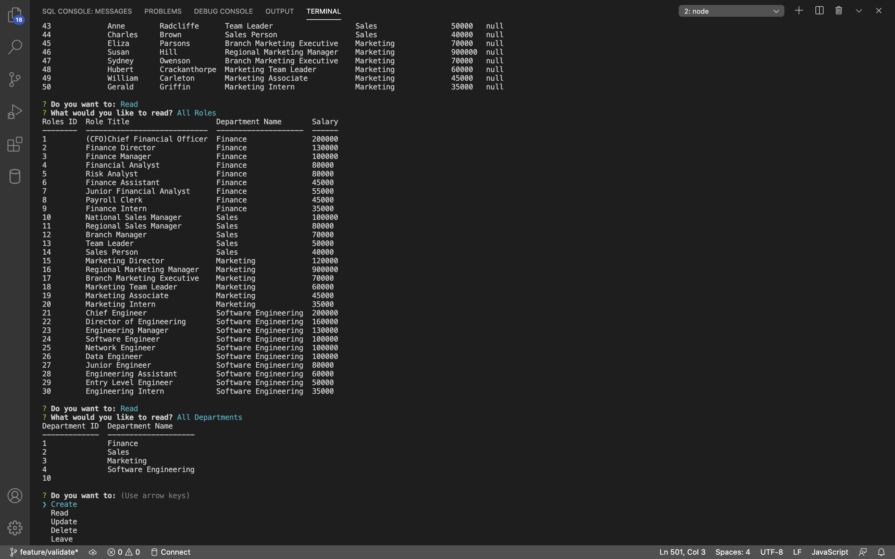
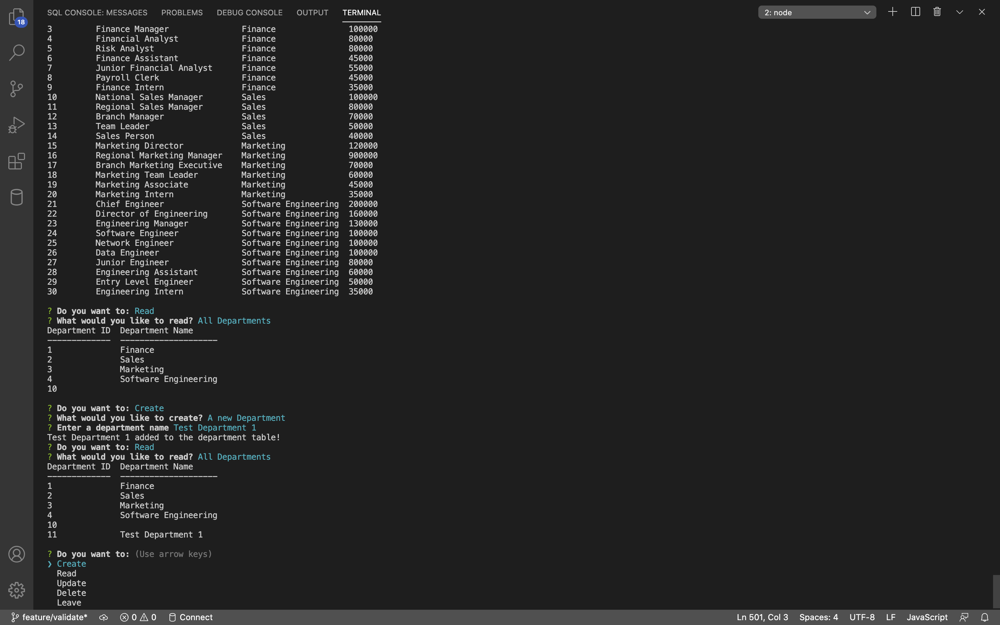
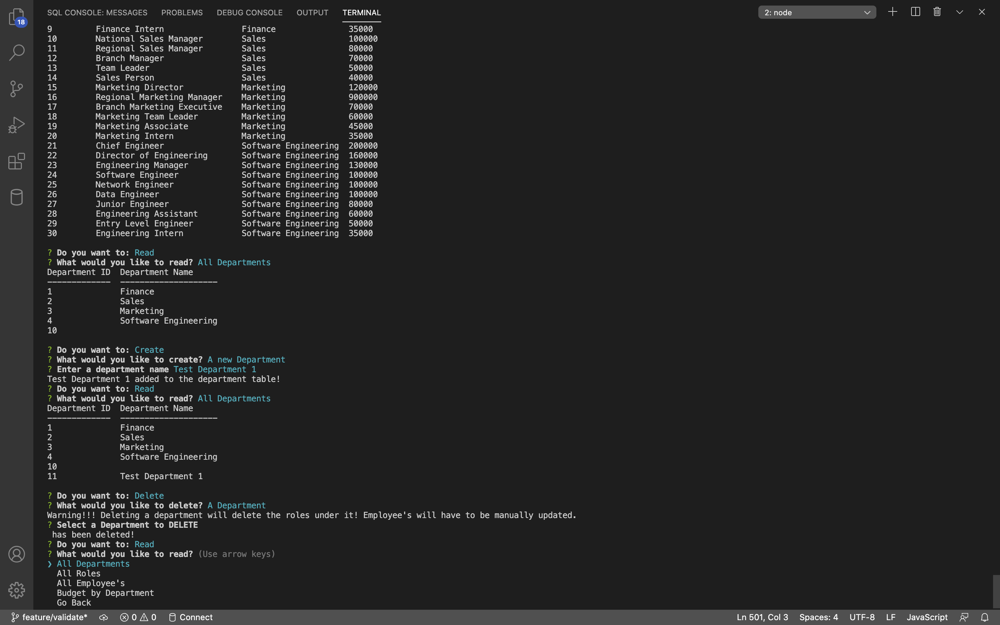
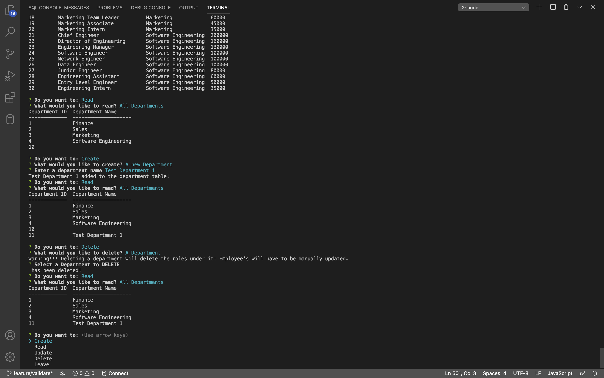
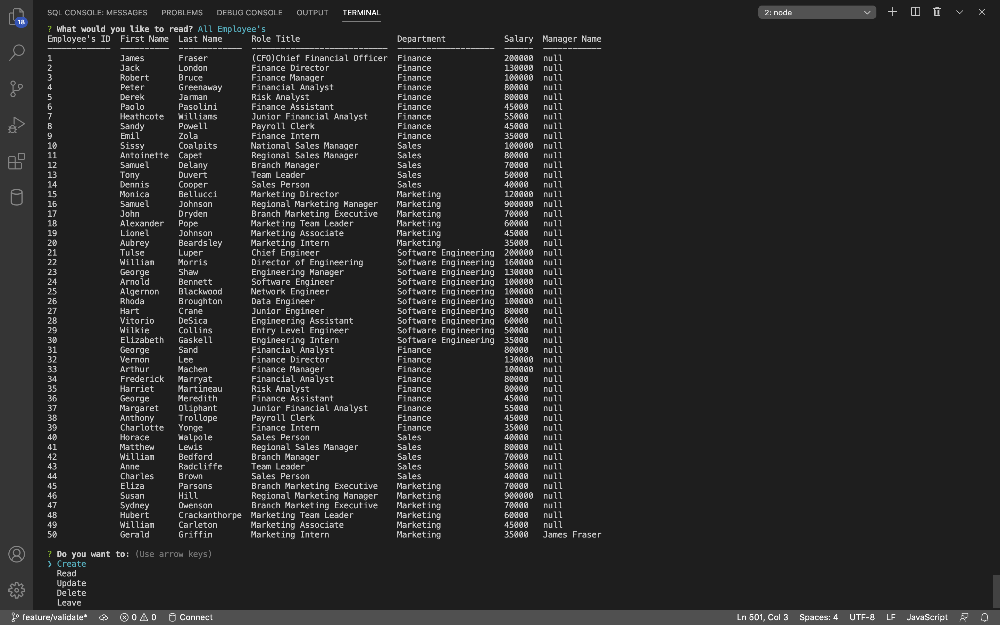

[](https://opensource.org/licenses/MIT)

# Employee Tracker

## Created by:

### Nikita Pokamestov

## License

Employee Tracker is licensed under the

[](https://opensource.org/licenses/MIT)

MIT License

A short and simple permissive license with conditions only requiring preservation of copyright and license notices. Licensed works, modifications, and larger works may be distributed under different terms and without source code.
Permissions | Limitations  |   Conditions
------------ | ------------  | ------------
Commercial use | Liability |   License and copyright notice
Modification | Warranty    |
Distribution |     |
Private use |     |

## Description

Node.js application using MySQL to Create,Read,Update,Delete employee information along with role's and department's.

## Table of Contents

* [Installation](#installation)

* [Usage](#usage)

* [Contributing](#contributing)

* [Tests](#tests)

* [Links](#links)

* [Screenshots](#Screenshots)

* [Questions](#questions)

## Installation

To Install necessary dependencies, run the following commands:

First download the MySQL Server from <a href="https://dev.mysql.com/downloads/mysql/">MySQL's downloads page</a> and then follow the prompts to install on computer, choosing legacy password encryption when asked.

```
git clone git@github.com:npokamestov/employee-tracker.git
```
```
npm init
```
```
npm i
```
```
npm install inquirer
```
```
npm install --save mysql2
```
```
npm install console.table --save
```

## Usage

```
npm start   //starts running the server
```

## Contributing

If you want to know about contributing to the repo:

Reach out to my GitHub Repository

## Tests

To run the tests, run the following command:

```
n/a
```

## Links 

* GitHub Repository:
    - [https://github.com/npokamestov/employee-tracker](https://github.com/npokamestov/employee-tracker)
* Walkthrough video:
    - [https://drive.google.com/file/d/17sGGhE4VX5sH5-0r-k8xYdbLTKKohypz/view](https://drive.google.com/file/d/17sGGhE4VX5sH5-0r-k8xYdbLTKKohypz/view)

## Screenshots
### Screenshot 1


### Screenshot 2


### Screenshot 3


### Screenshot 4


### Screenshot 5


## Questions?

If there are any questioins please refer to this email or leave a comment in the repository

Email: npokamestov@yahoo.com

Github Website: https://github.com/npokamestov/
